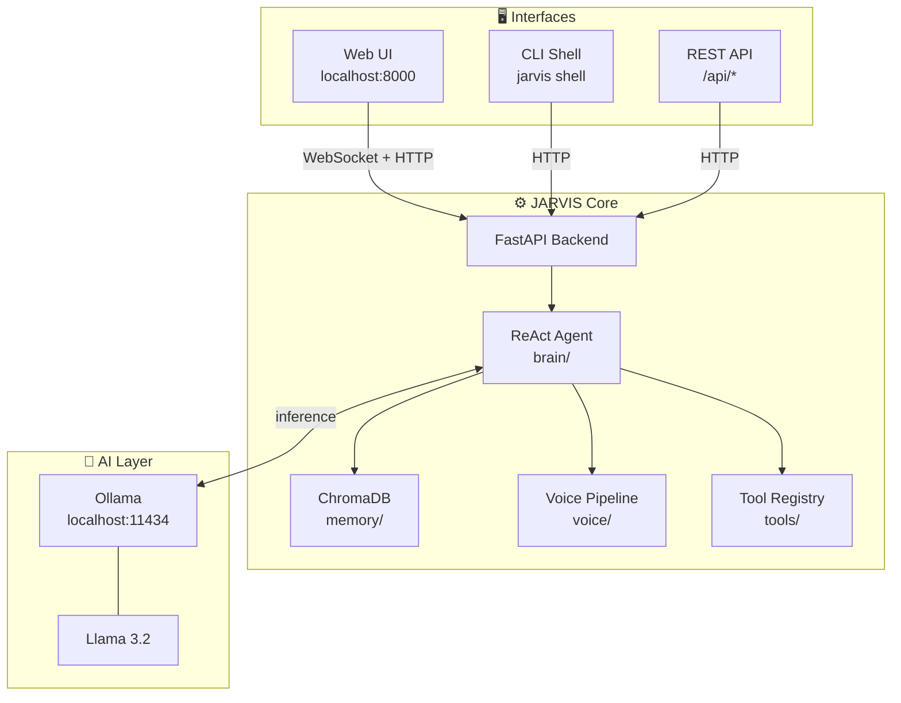
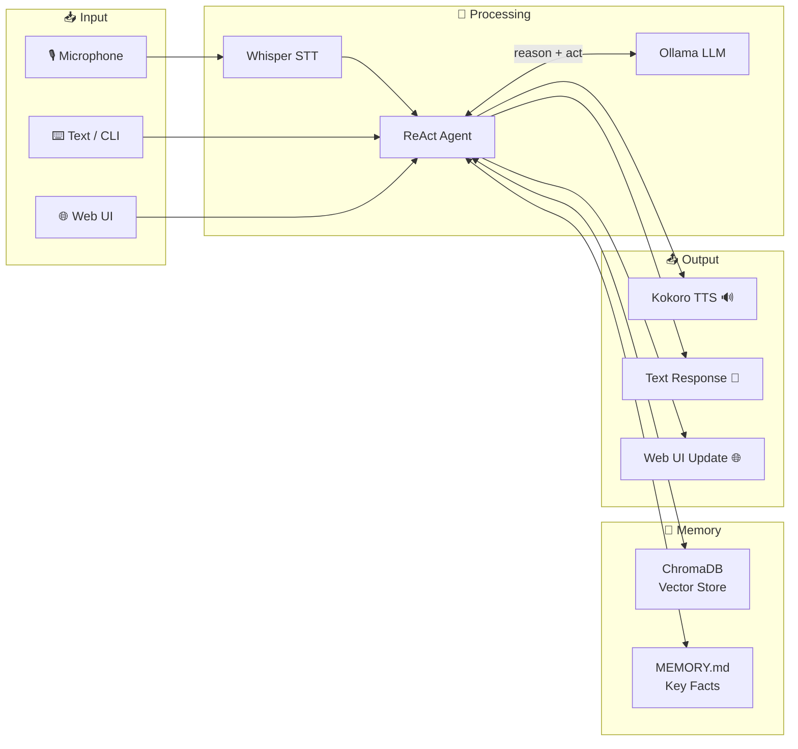

<div align="center">


# 👾 JARVIS
### *Just A Rather Very Intelligent System*

**A privacy-first, fully local AI assistant — voice, web UI, and CLI in one package.**

<br/>

[](https://www.python.org/downloads/)
[](https://fastapi.tiangolo.com/)
[](https://react.dev/)
[](https://ollama.com)
[](https://www.trychroma.com/)
[](LICENSE)
[]()

<br/>

> 🔒 **100% local. No cloud. No telemetry. Your data never leaves your machine.**

<br/>

[🚀 Quick Start](#-quick-start) · [✨ Features](#-features) · [🏗️ Architecture](#️-architecture) · [📁 Project Structure](#-project-structure) · [🛠️ Tech Stack](#️-tech-stack) · [📖 Docs](#-documentation)

---

</div>

## 🚀 Quick Start

> **New to JARVIS?** Follow the setup guide first → **[HowToRun.md](HowToRun.md)**

```bash
# 1. Clone the repository
git clone https://github.com/your-username/JARVIS.git && cd JARVIS

# 2. Install dependencies
pip install -r requirements.txt

# 3. Configure your environment
cp .env.example .env

# 4. Launch JARVIS
python main.py
```

Open your browser at **`http://localhost:8000`** and start chatting.

---

## ✨ Features

<table>
<tr>
<td width="50%">

### 🤖 Intelligent Chat
Conversational AI powered by a **ReAct agent loop** — reasons step by step, uses tools, and responds with context awareness. No hallucinated shortcuts; it thinks before it speaks.

### 🧠 Persistent Memory
Remembers you across sessions. **ChromaDB** stores vector embeddings of your conversations, while `MEMORY.md` holds distilled facts — names, preferences, and key context.

### 🎤 Voice Interface
Speak naturally. **Faster-Whisper** transcribes your voice locally, and **Kokoro TTS** reads responses back. Fully offline — no API keys, no latency from the cloud.

</td>
<td width="50%">

### 🌐 Web UI
A polished **React + TypeScript** interface served at `localhost:8000`. Chat, view memory, manage settings — all in your browser.

### 💻 CLI Shell
Power users can interact via a rich **terminal interface** — ideal for scripting, piping, or when you just prefer the keyboard.

### 🔌 REST API
JARVIS exposes a clean `/api/*` REST interface so you can build integrations, trigger automations, or connect your own tools.

### 📊 System Monitoring
Ask JARVIS "how's my CPU?" — the built-in `system_monitor` tool reports CPU, RAM, and GPU stats in real time.

</td>
</tr>
</table>

---

## 🏗️ Architecture

### System Overview



### Request Lifecycle



---

## 📁 Project Structure

```
JARVIS/
│
├── 🖥️  backend/           # FastAPI server, WebSocket handlers, routes
├── 🧠  brain/             # ReAct agent, LangChain chains, prompt templates
├── 💾  memory/            # ChromaDB vector store + MEMORY.md fact file
├── 🛠️  tools/             # Tool modules: browser, code_exec, system_monitor, etc.
├── 🎤  voice/             # STT (Faster-Whisper) + TTS (Kokoro) pipeline
├── 🌐  ui/                # React 18 + TypeScript + Vite frontend
├── 💻  cli/               # Python CLI package (argparse-based)
│
├── 📖  Docs/              # Extended documentation
├── 🧪  tests/             # Test suites and bug regression tests
│
├── main.py               # 🚀 Application entry point
├── HowToRun.md           # 📋 Step-by-step setup guide
├── .env                  # ⚙️  Configuration (API endpoints, model names, etc.)
└── requirements.txt      # 📦 Python dependencies
```

---

## 🛠️ Tech Stack

| Layer | Technology | Purpose |
|-------|-----------|---------|
| **Backend** | [FastAPI](https://fastapi.tiangolo.com/) + Python 3.11+ | REST API, WebSocket, async server |
| **AI Inference** | [Ollama](https://ollama.com) (Llama 3.2) | Local LLM — no cloud needed |
| **Agent Framework** | [LangChain](https://langchain.com/) | ReAct agent loop, chain orchestration |
| **Memory / RAG** | [ChromaDB](https://www.trychroma.com/) | Vector embeddings, semantic recall |
| **Speech-to-Text** | [Faster-Whisper](https://github.com/SYSTRAN/faster-whisper) | Offline voice transcription |
| **Text-to-Speech** | [Kokoro](https://github.com/remsky/Kokoro-FastAPI) | Offline neural TTS |
| **Frontend** | React 18 + TypeScript + Vite | Snappy, modern web interface |
| **CLI** | Python (argparse) | Terminal interface |

---

## ⚙️ Configuration

JARVIS is configured via a `.env` file in the project root:

```env
# Ollama
OLLAMA_BASE_URL=http://localhost:11434
OLLAMA_MODEL=llama3.2

# Server
BACKEND_PORT=8000
BACKEND_HOST=0.0.0.0

# Memory
CHROMA_PERSIST_DIR=./memory/chroma
MEMORY_FILE=./memory/MEMORY.md

# Voice (optional)
VOICE_ENABLED=true
WHISPER_MODEL=base
```

---

## 🧑‍💻 Development

### Running Modes

```bash
# Full app — backend + web UI
python main.py

# Backend API only (no UI)
python -m backend.main

# CLI shell
python -m cli shell

# CLI — single query
python -m cli ask "What's the weather like today?"
```

### Running Tests

```bash
# Full test suite
pytest tests/

# Specific bug regression test
PYTHONIOENCODING=utf-8 python tests/Bugs_Testing/B1Test.py

# Verbose output
pytest tests/ -v --tb=short
```

### Adding a New Tool

1. Create a new module in `tools/your_tool.py`
2. Implement the tool interface (see `tools/README.md`)
3. Register it in `brain/tool_registry.py`
4. The ReAct agent will automatically discover and use it

---

## 📖 Documentation

| Document | Description |
|----------|-------------|
| [HowToRun.md](HowToRun.md) | Prerequisites, installation, and first-run walkthrough |
| [Docs/](Docs/) | Architecture deep-dives, API reference, tool guides |

---

## 🗺️ Roadmap

- [ ] Multi-model support (swap LLMs without restart)
- [ ] Plugin system for third-party tools
- [ ] Mobile-responsive web UI improvements
- [ ] Long-term memory summarization
- [ ] Wake-word detection for hands-free activation

---

## 🤝 Contributing

Contributions are welcome! Please open an issue first to discuss what you'd like to change. For bug fixes, feel free to submit a PR directly.

---

## 📄 License

MIT License — see [LICENSE](LICENSE) for full details.

---

<div align="center">

**Built for privacy. Designed for speed. Made to be yours.**

*🤖 JARVIS — Your Personal AI Assistant*

</div>