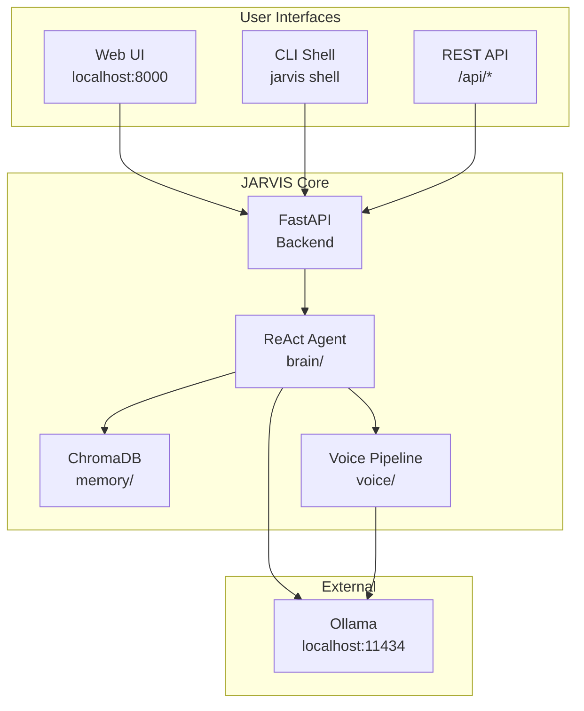
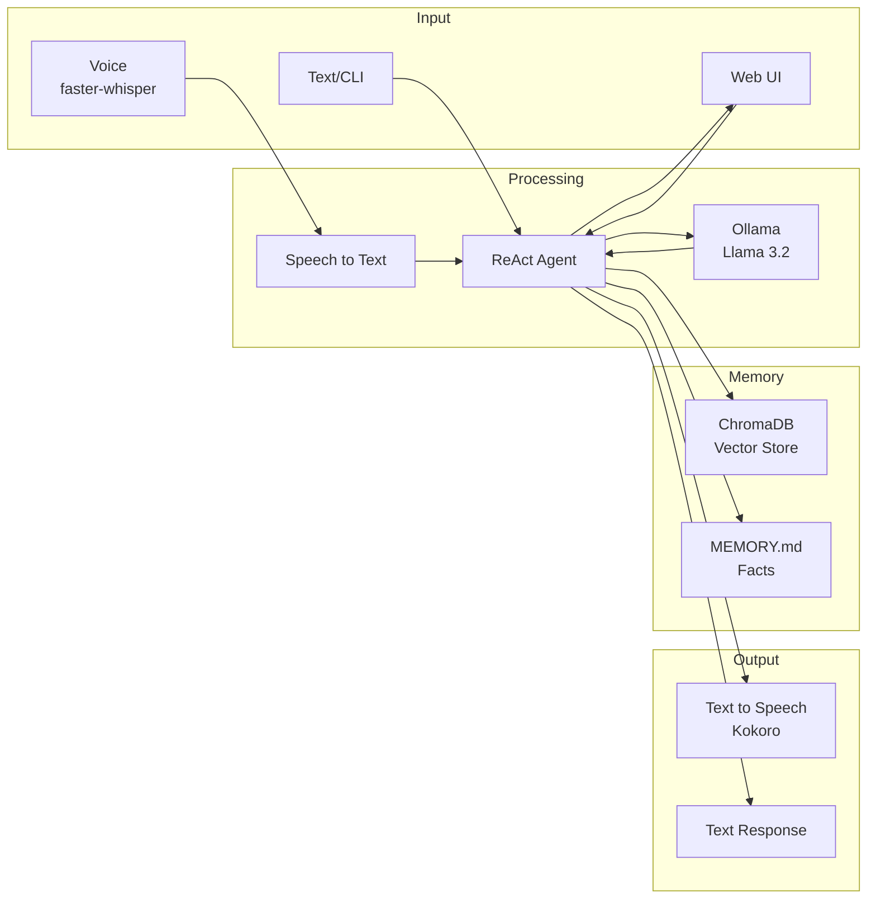

<div align="center">

# 🤖 JARVIS AI Assistant

[](https://www.python.org/downloads/)
[](LICENSE)
[]()
[](https://ollama.com)

*A privacy-focused, always-available AI assistant that runs entirely locally on Windows*

</div>

---

## 🚀 Quick Start

**New to JARVIS?** → **[How to Run](HowToRun.md)**

---

## Overview

JARVIS is your personal AI assistant with voice, web UI, and CLI interfaces. It runs entirely locally using Ollama for AI inference, ensuring your data stays private.



---

## Features

| Feature | Description |
|---------|-------------|
| 🤖 **AI Chat** | Conversational AI with context awareness using ReAct agent loop |
| 🧠 **Memory** | Persistent conversation history with ChromaDB vector storage |
| 🎤 **Voice** | Speech-to-text (Whisper) and text-to-speech (Kokoro) |
| 📊 **System Monitoring** | CPU, memory, GPU stats via system_monitor tool |
| 🌐 **Web UI** | Beautiful browser-based React interface |
| 💻 **CLI** | Terminal interface with interactive shell |
| 🔌 **API** | REST API for integrations |

---

## Architecture



---

## Project Structure

```
JARVIS/
├── backend/           # FastAPI server + WebSocket
├── brain/             # ReAct agent, chains, tools
├── cli/               # Python CLI package
├── memory/            # ChromaDB + MEMORY.md
├── tools/             # System tools (browser, code_exec, etc.)
├── ui/                # React frontend (Vite + TypeScript)
├── voice/             # STT/TTS pipeline
├── Docs/              # Documentation
├── tests/             # Test suites
├── main.py            # Entry point
├── HowToRun.md        # Quick start guide
└── .env               # Configuration
```

---

## Documentation

| Document | Description |
|----------|-------------|
| [HowToRun.md](HowToRun.md) | Step-by-step setup and running instructions |
| [Docs/](Docs/) | Additional documentation |

---

## Tech Stack

| Layer | Technology |
|-------|------------|
| Backend | FastAPI, Python 3.11+ |
| AI | Ollama (Llama 3.2), LangChain |
| Memory | ChromaDB, MEMORY.md |
| STT | Faster Whisper |
| TTS | Kokoro |
| Frontend | React 18, TypeScript, Vite |
| CLI | Python (argparse), Node.js |

---

## Development

### Running in Development

```bash
# Full app with UI
python main.py

# Backend only (API)
python -m backend.main

# CLI (development)
python -m cli shell
```

### Testing

```bash
# Run all tests
pytest tests/

# Run bug fix tests
PYTHONIOENCODING=utf-8 python tests/Bugs_Testing/B1Test.py
```

---

## License

MIT License - See [LICENSE](LICENSE) file

---

## Support

For issues and questions, please check the Docs folder or open an issue on GitHub.

---

*🤖 JARVIS - Your Personal AI Assistant*
